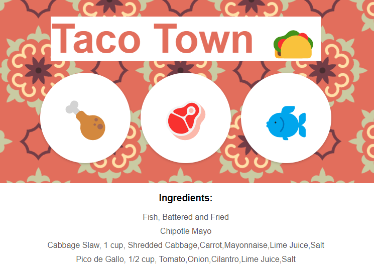

# Taco Town

## Backend Web App

## Description

Welcome to Taco Town! A backend web project showing you the ingredients to a taco based on the picture you select.

## Table of Contents

-   [Taco Town](#taco-town)
-   [Backend Web App](#backend-web-app)
-   [Description](#description)
-   [Purpose](#purpose)
-   [Technologies Used](#technologies-used)
-   [Usage](#usage)
-   [License](#license)
-   [About](#about)
-   [Badges](#badges)

## Purpose

Taco Town is a web project presented by [Dr. Angela Yu](https://www.udemy.com/user/4b4368a3-b5c8-4529-aa65-2056ec31f37e/) within her [Udemy Course](https://www.udemy.com/course/the-complete-web-development-bootcamp/)

## Technologies Used

- EJS
- Express
- JavaScript

## Usage

### Step 1

Download Repository and open the project in an Editor of your choice. I recommend VS Code.

### Step 2

Install dependencies with <em>npm i</em>.

### Step 3

Run the code using [Nodemon](https://www.youtube.com/watch?v=cYHPNurmXGU).
<em>Nodemon video created and provided by <b>redfriends</b></em>.

### Step 4

Using Chrome go to localhost:3000

### Step 5

Click one of the three images to view the taco name and ingredients.

## License

MIT License

Copyright (c) [2022] [David Whipple]

Permission is hereby granted, free of charge, to any person obtaining a copy of this software and associated documentation files (the "Software"), to deal in the Software without restriction, including without limitation the rights to use, copy, modify, merge, publish, distribute, sublicense, and/or sell copies of the Software, and to permit persons to whom the Software is furnished to do so, subject to the following conditions:

The above copyright notice and this permission notice shall be included in all copies or substantial portions of the Software.

THE SOFTWARE IS PROVIDED "AS IS", WITHOUT WARRANTY OF ANY KIND, EXPRESS OR IMPLIED, INCLUDING BUT NOT LIMITED TO THE WARRANTIES OF MERCHANTABILITY, FITNESS FOR A PARTICULAR PURPOSE AND NONINFRINGEMENT. IN NO EVENT SHALL THE AUTHORS OR COPYRIGHT HOLDERS BE LIABLE FOR ANY CLAIM, DAMAGES OR OTHER LIABILITY, WHETHER IN AN ACTION OF CONTRACT, TORT OR OTHERWISE, ARISING FROM, OUT OF OR IN CONNECTION WITH THE SOFTWARE OR THE USE OR OTHER DEALINGS IN THE SOFTWARE.

## About

Hello, my name is David. 
You can email me at dwhipp88@gmail.com. 
Check out my -> [github](https://github.com/D-Whipp).  
Check out my -> [portfolio](https://splendid-ganache-f82581.netlify.app/).

## Badges

